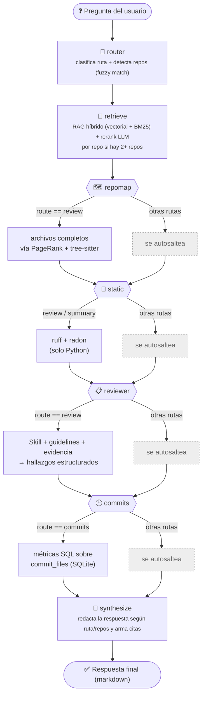
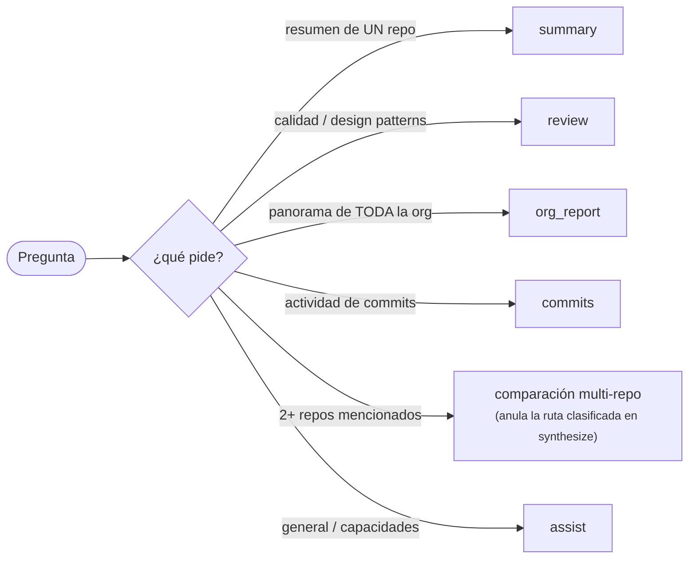

# NTech Code Review Agent

Agente que revisa los repositorios de la org de GitHub **NTech-TRNM**, aplica una
**Skill de buenas prácticas de código** (design patterns, code smells) apoyada en
**guidelines de Software Development y Ciencia de Datos**, y produce **reportes**
con áreas de oportunidad y estado contextualizado de cada repo.

Basado en la arquitectura de [RAG_Queries_Agent](https://github.com/Jorge-Polanco-Roque/RAG_Queries_Agent)
(LangGraph supervisor + RAG híbrido + clientes compatibles OpenAI).

## Arquitectura (split cloud / local + backend de LLM intercambiable)

Todo el driver (LangGraph, RAG, GitHub, UI) corre siempre local. El **backend
del LLM** es intercambiable con una sola variable de entorno
(`NTECH_LLM_BACKEND`) — el resto del código no sabe ni le importa cuál está
activo:

```
┌─────────────────────────── Local (tu Windows) ───────────────────────────┐
│  Streamlit UI  ──►  LangGraph supervisor                                  │
│                       ├─ retriever  ──►  Chroma (RAG híbrido + rerank)    │
│                       ├─ repo map   ──►  archivos completos por PageRank  │
│                       │                   (tree-sitter, offline)          │
│                       ├─ reviewer   ──►  Skill + guidelines + análisis    │
│                       │                   estático (ruff/radon)           │
│                       ├─ commits    ──►  actividad de commits (SQLite)    │
│                       └─ synthesizer ─►  respuesta compacta con citas     │
│  Embeddings locales (bge-m3)   GitHub sync (clonar/pull) + GitHub MCP     │
│  Reportes ejecutivos (5 secciones, sin jerga) ──► data/reports/*.md       │
└───────────────────────────────┬──────────────────────────────────────────┘
                                 │  NTECH_LLM_BACKEND = cloudrun | ollama | anthropic
              ┌──────────────────────────────┼──────────────────────────────┐
              ▼                              ▼                              ▼
┌─────────────────────────┐   ┌───────────────────────┐   ┌───────────────────────────┐
│ GCP Cloud Run (GPU L4)  │   │ Ollama (local)        │   │ API de Anthropic (Claude) │
│ vLLM + Qwen3-Coder-30B  │   │ modelo pequeño en tu   │   │ pay-per-token, sin infra  │
│ self-hosted, scale-to-0 │   │ hardware, offline      │   │ que mantener              │
└─────────────────────────┘   └───────────────────────┘   └───────────────────────────┘
```

| Backend | Cuándo usarlo | Costo |
|---|---|---|
| `cloudrun` | Modelo open-weight self-hosted (el ángulo de tesis: LLM propio, no comercial) | GPU L4 ~$0.67/hr solo mientras infiere; scale-to-zero en reposo |
| `ollama` | Desarrollo/demo local, sin gastar nada, sin depender de la nube | Gratis (tu hardware) |
| `anthropic` | Máxima calidad/confiabilidad sin mantener infraestructura | Pay-per-token vía [console.anthropic.com](https://console.anthropic.com) (cuenta separada de Claude Pro/Max) |

## Flujo de trabajo del agente

El agente es un **grafo LangGraph lineal** (`ntech_agent/graph/builder.py`), compilado
una vez y persistido con checkpointer SQLite (memoria por conversación/`thread_id`,
con fallback a `MemorySaver` si SQLite no está disponible). Las aristas son siempre
las mismas; lo que cambia según la ruta clasificada es si cada nodo hace trabajo o
se auto-omite (devuelve `{}`):



Cada nodo es una función pura de un `AgentState` (TypedDict) que devuelve una
actualización parcial del estado. Los nodos `repomap`, `static`, `reviewer` y
`commits` están siempre en el grafo pero **se auto-omiten** (recuadros grises en
el diagrama) si la ruta elegida no los necesita, en vez de estar condicionalmente
cableados como aristas separadas.

### 1. `router` — clasificación de la consulta

Un LLM con salida estructurada clasifica la pregunta del usuario en una de 5 rutas
y detecta **todos** los repos mencionados (no solo uno), comparándolos por
similitud difusa (`difflib`) contra los repos ya clonados en `data/repos/`:

- **`summary`** — resumen/estado de UN repo puntual nombrado explícitamente.
- **`review`** — revisión de calidad de código y design patterns de un repo.
- **`org_report`** — panorama de TODA la organización o de "todos los repos".
- **`commits`** — actividad/historial de commits (últimos cambios, quién
  contribuye) — explícitamente separado de "calidad de código".
- **`assist`** — pregunta general o sobre las capacidades del agente.

Si la clasificación estructurada falla (los modelos locales/pequeños son poco
fiables con tool calling), cae a un fallback heurístico por palabras clave que
también intenta detectar nombres de repo por substring, para no perder las
garantías de "piso por repo" del retrieval multi-repo (ver más abajo).
`state["repo"]` (singular) solo se llena cuando hay **exactamente un** repo
matcheado (`None` si son 0 o 2+), lo que permite que los nodos escritos antes de
soportar multi-repo (`repomap`, `static`, `reviewer`) se autosalteen sin saber que
existe una consulta multi-repo.



La rama de **comparación multi-repo** no es una ruta más del clasificador: en
`synthesize` se chequea `len(repos) > 1` **antes** que la lógica de `review`, así
que una pregunta como "diferencia entre ws-arg y ws-br" (clasificada `review`)
termina comparando ambos repos con el contexto ya recuperado de cada uno, en vez
de intentar una revisión formal con `repo=None`.

### 2. `retrieve` — RAG híbrido

Búsqueda vectorial (Chroma, embeddings locales) fusionada con BM25 léxico vía
Reciprocal Rank Fusion (`EnsembleRetriever`, 0.5/0.5), con **rerank opcional por
LLM** (0–1, umbral configurable) que degrada de forma segura al orden híbrido si
el LLM falla o no hay candidatos por encima del umbral. Con **2 o más repos**
(consultas comparativas), tanto el retrieval como el rerank corren **por repo, no
en un pool combinado** — un piso mínimo de `fetch_k`/`k` por repo evita que un
repo entero desaparezca por truncamiento o por un umbral de relevancia desparejo
(bug real reproducido y corregido en dos etapas: primero en el retrieval, después
también en el rerank).

### 3. `repomap` — contexto de archivo completo (solo `route == review`)

Reemplaza los chunks de RAG por **archivos completos**, elegidos con PageRank
personalizado (`networkx`) sobre el grafo de dependencias del repo (construido
offline con tree-sitter al indexar), usando lo que el RAG ya recuperó como semillas
de boost. Se autosaltea si el repo tiene muy pocos archivos con símbolos
extraídos (p. ej. un repo solo de notebooks/YAML) o si `NTECH_REPOMAP_ENABLED`
está apagado.

### 4. `static` — análisis estático (`route in {review, summary}`)

Corre linters/métricas por lenguaje (hoy solo Python: ruff + radon
complejidad/mantenibilidad) sobre el repo objetivo como "evidencia objetiva" que
se inyecta junto al contexto de RAG.

### 5. `reviewer` — aplica la Skill (solo `route == review`)

Carga la Skill (`skills/code_best_practices/SKILL.md` + `rubric.yaml`), combina
código recuperado + guidelines recuperadas + hallazgos estáticos en un solo
prompt, y pide salida estructurada (`resumen`, `fortalezas`, `áreas de
oportunidad`, `hallazgos` con ubicación/severidad/guía citada). Si la salida
estructurada falla, cae a texto libre; si **esa** llamada también falla (p. ej. un
529 transitorio del proveedor), degrada a un mensaje estático en vez de tirar
abajo el grafo — doble capa de protección deliberada en todo el código que llama
al LLM.

### 6. `commits` — actividad de commits (solo `route == commits`)

Lee métricas ya calculadas por SQL determinístico (`ntech_agent/commits/query.py`,
sobre una tabla `commit_files` poblada por `python -m scripts.sync_commits`, un
paso **manual y separado** del pipeline de indexado): último commit, top
contribuidores y detalle commit-por-commit con resúmenes LLM opcionales. El LLM
solo redacta la respuesta a partir de estos datos, no inventa fechas ni autores.

### 7. `synthesize` — respuesta final

Arma la respuesta en markdown según la ruta:
- **`commits`** → redacta sobre `commit_facts` (sin bloque de "Fuentes" de RAG).
- **2+ repos mencionados** (comparación) → sin importar la ruta clasificada,
  compara/relaciona los repos usando el contexto multi-repo ya recuperado; si a
  algún repo no le llegó contexto, lo dice explícitamente en vez de inventar.
- **`review`** → responde puntualmente lo preguntado (no siempre vuelca la
  revisión completa) usando la evidencia estructurada de `reviewer`.
- **`summary` / `org_report` / `assist`** → resumen/panorama/respuesta general
  sobre el contexto recuperado.

Todas las respuestas incluyen citas (`repo/ruta`, deduplicadas por archivo) salvo
la ruta `commits`. Cada llamada al LLM en este nodo tiene su propio
try/except con degradación a un mensaje de error legible.

### Reportes ejecutivos (fuera del grafo interactivo)

`scripts/run_review.py` no pasa por `router` ni por `synthesize`: llama
directamente a `retrieve → repomap → static → reviewer` con `route="review"`
fijado a mano, y `report/executive.py` arma un documento de 5 secciones fijas
para stakeholders no técnicos (sin jerga ni citas archivo:línea), con una sola
llamada LLM combinada para "Hallazgos" + "Recomendaciones" (las demás secciones
son plantillas de Python o reciclan el resumen ya generado por `reviewer`).
Exportación a PDF best-effort vía la dependencia opcional `markdown-pdf`.

### Fortalezas actuales

- **Degradación en cascada, no crasheos**: cada llamada estructurada tiene
  fallback a texto libre, y cada fallback tiene su propio fallback a un mensaje
  estático — motivado por un incidente real en producción (un 529 sin capturar
  tumbó el Streamlit completo).
- **Backend de LLM intercambiable sin tocar el grafo** (`cloudrun` / `ollama` /
  `anthropic`), lo que permite comparar un modelo open-weight self-hosted contra
  Claude sin cambiar una línea de los nodos.
- **Multi-repo con garantías reales de representación** (piso por repo en
  retrieval y en rerank), no solo en la detección de ruta.
- **Repo map con PageRank** le da al reviewer archivos completos y relevantes en
  vez de solo fragmentos sueltos, mejorando el contexto para hallazgos que cruzan
  varias funciones/archivos.
- **Evidencia objetiva** (ruff/radon) complementa al LLM en vez de depender solo
  de su criterio subjetivo.
- **Separación reporte técnico vs. ejecutivo**: el mismo `review_data`
  estructurado alimenta tanto el chat (compacto, con citas) como el reporte
  ejecutivo (sin jerga), sin volver a llamar al LLM para generar el resumen.

### Debilidades / limitaciones conocidas

- **Referencias cruzadas del repo map son regex, no AST real**: se aproximan por
  coincidencia de nombre de símbolo por límite de palabra, lo que puede generar
  falsos positivos/negativos en el grafo de dependencias (documentado como
  compromiso de alcance de tesis).
- **El fallback heurístico del router no soporta multi-repo tan bien** como la
  clasificación estructurada: detecta repos por substring simple, sin fuzzy
  matching ni desambiguación.
- **Análisis estático solo cubre Python** (ruff + radon); repos en otros
  lenguajes no reciben esa evidencia objetiva, aunque el repo map sí soporta más
  lenguajes (C/C++, JS/JSX) vía tree-sitter.
- **`sync_commits` es un paso manual separado**: si no se corrió, la ruta
  `commits` responde con "sin datos sincronizados" en vez de fallar o
  auto-sincronizar.
- **Costo/latencia crecen linealmente con el número de repos** en consultas
  comparativas (retrieval y rerank corren una vez por repo) — aceptable para las
  2-5 repos típicas de una comparación, pero no pensado para escalar a decenas.
- **Rerank y clasificación de ruta dependen de que el LLM siga instrucciones de
  salida estructurada**; con el backend `ollama` en modelos pequeños esto falla
  con más frecuencia, cayendo a heurísticas menos precisas.
- **Sin evaluación end-to-end de la calidad de la revisión final**, solo de
  retrieval (`scripts/eval.py` mide recall@k/MRR, no la precisión de los
  hallazgos ni de las recomendaciones generadas).

## Requisitos

- Python 3.11+
- Cuenta de GCP con facturación (usa créditos si tienes) y `gcloud` CLI
- Un **PAT de GitHub** con lectura de los repos de la org
- (Opcional, para el fallback local) [Ollama](https://ollama.com)

## Instalación (driver local)

```powershell
python -m venv .venv
.venv\Scripts\Activate.ps1
pip install -e .
copy .env.example .env   # y rellena los valores
```

## Puesta en marcha

### 1. Desplegar el modelo en GCP (una vez)

```bash
cd deploy
bash deploy.sh   # sube los pesos a GCS y despliega el Cloud Run con GPU L4
```

Copia la URL resultante a `NTECH_CLOUDRUN_URL` en tu `.env`.
Ver [deploy/README.md](deploy/README.md) para el detalle y la seguridad (IAM).

### 2. Sincronizar e indexar los repos

```powershell
python -m scripts.sync_repos      # clona/actualiza todos los repos de la org
python -m scripts.build_index     # indexa código + guidelines en Chroma, y calcula el repo map
```

### 3. Usar el agente

```powershell
# UI de chat
streamlit run ui/streamlit_app.py

# o generar un reporte por CLI
python -m scripts.run_review --repo ws-arg
python -m scripts.run_review --org           # reporte de toda la organización
```

Ejemplo de Q&A en la UI: *"Dame un resumen de ws-arg"* → resumen contextual del
repo con citas a los archivos relevantes.

## Cambiar de backend de LLM

Solo edita `NTECH_LLM_BACKEND` en `.env` — el resto del código no cambia.

**Ollama (local, gratis, offline):**
```powershell
ollama pull qwen2.5-coder:7b
```
```
NTECH_LLM_BACKEND=ollama
```

**Anthropic (API de Claude, pay-per-token):**
1. Crea una cuenta en [console.anthropic.com](https://console.anthropic.com) (es
   **independiente** de una suscripción Claude Pro/Max — no la incluye) y agrega
   crédito (mínimo $5).
2. Genera una API key y ponla en `.env`:
```
NTECH_LLM_BACKEND=anthropic
NTECH_ANTHROPIC_API_KEY=sk-ant-...
```

**Cloud Run (self-hosted, ver sección "Puesta en marcha" arriba):**
```
NTECH_LLM_BACKEND=cloudrun
```

Prueba rápida del backend activo:
```powershell
python -m ntech_agent.llm
```

## Costo (tesis)

Con **scale-to-zero**, en reposo pagas ≈ solo el storage GCS de los pesos
(centavos). La GPU L4 (~$0.67/hr) se cobra **solo mientras el modelo infiere**.
Para corridas batch largas, considera `min-instances=1` temporal y apágalo al terminar.

## Estructura

```
ntech-trnm/
├── config/settings.py       # configuración tipada (Pydantic Settings)
├── ntech_agent/             # driver: LLM, RAG, repo map, GitHub, grafo, reporte
│   └── repomap/             # grafo de dependencias (tree-sitter) + PageRank, offline
├── guidelines/              # guidelines de Software Dev y Ciencia de Datos (RAG + MCP)
├── skills/code_best_practices/  # la "Skill" de revisión (rúbrica + design patterns)
├── deploy/                  # imagen vLLM + Cloud Run (GPU L4)
├── ui/streamlit_app.py      # frontend v1
├── scripts/                 # sync, build_index, run_review, eval
└── tests/
```

## Evaluación (tesis)

```powershell
python -m scripts.eval        # recall@k y MRR sobre el set gold (tests/gold.jsonl)
```
